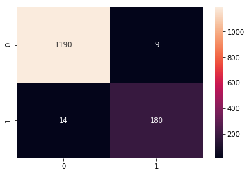
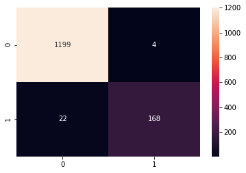

# logistic_regression_classification.py

```python
import pandas as pd

from sklearn.feature_extraction.text import TfidfVectorizer
from sklearn.linear_model import LogisticRegressionCV
from sklearn.pipeline import make_pipeline
from sklearn.model_selection import GridSearchCV

from sklearn.model_selection import train_test_split
from sklearn.metrics import confusion_matrix

import seaborn as sns
import matplotlib.pyplot as plt


df = pd.read_csv('SPAM text message 20170820 - Data.csv')

clf = make_pipeline(
    TfidfVectorizer(stop_words='english'),
    LogisticRegressionCV(cv=5 , solver='liblinear', scoring='roc_auc'))

parameters = {
    'tfidfvectorizer__ngram_range': [(1, 1), (1, 2), (1, 3)],
    'logisticregressioncv__cv': [3, 4, 5],
    'logisticregressioncv__solver': ['newton-cg', 'lbfgs', 'liblinear']
}

clf = GridSearchCV(clf, parameters, cv=4, scoring='roc_auc')


X = df['Message']
Y = pd.get_dummies(df['Category'])['spam']

x_train, x_test, y_train, y_test = train_test_split(X, Y)

clf.fit(x_train, y_train)
print(clf.best_params_)
print(f'score: {clf.score(x_test, y_test)}')

```

    {'logisticregressioncv__cv': 5, 'logisticregressioncv__solver': 'newton-cg', 'tfidfvectorizer__ngram_range': (1, 2)}
    score: 0.9909331659544466


```python
y_pred = clf.predict(x_test)
cm = confusion_matrix(y_test, y_pred)
sns.heatmap(cm, annot=True, fmt='d')
plt.show()

samples = df.loc[y_test.index].copy()
samples['true_result'] = y_test
samples['model_perdict'] = y_pred
print(samples.sample(n=10))

```





         Category                                            Message  true_result  \
    5175      ham  Raji..pls do me a favour. Pls convey my Birthd...            0   
    2221      ham  But really quite funny lor wat... Then u shd h...            0   
    1118     spam  449050000301 You have won a £2,000 price! To c...            1   
    5436      ham                         Mode men or have you left.            0   
    1622      ham  Living is very simple.. Loving is also simple....            0   
    9        spam  Had your mobile 11 months or more? U R entitle...            1   
    4167      ham  Well if I'm that desperate I'll just call arma...            0   
    3072      ham     Apart from the one i told you about yesterday?            0   
    2739      ham  I sent you the prices and do you mean the  &lt...            0   
    4282      ham  Wn u r hurt by d prsn who s close 2 u, do figh...            0   
    
          model_perdict  
    5175              0  
    2221              0  
    1118              1  
    5436              0  
    1622              0  
    9                 1  
    4167              0  
    3072              0  
    2739              0  
    4282              0  

---

# compare_estimators.py

```python
import pandas as pd

from sklearn.feature_extraction.text import TfidfVectorizer
from sklearn.linear_model import LogisticRegressionCV
from sklearn.naive_bayes import BernoulliNB
from sklearn.svm import SVC

from sklearn.pipeline import Pipeline
from sklearn.model_selection import GridSearchCV

from sklearn.model_selection import train_test_split
from sklearn.metrics import confusion_matrix

import seaborn as sns
import matplotlib.pyplot as plt


df = pd.read_csv('SPAM text message 20170820 - Data.csv')

clf = Pipeline([('tfidf', TfidfVectorizer(stop_words='english')),
                ('clf', None)])

parameters = {
    'tfidf__ngram_range': [(1, 1), (1, 2), (1, 3)],
    'clf': [LogisticRegressionCV(cv=4 , solver='newton-cg', scoring='roc_auc'),
            SVC(gamma='auto'), BernoulliNB()],
}

clf = GridSearchCV(clf, parameters, cv=4, scoring='roc_auc')


X = df['Message']
Y = pd.get_dummies(df['Category'])['spam']

x_train, x_test, y_train, y_test = train_test_split(X, Y)

clf.fit(x_train, y_train)
print(clf.best_params_)
print(f'score: {clf.score(x_test, y_test)}')

```

    {'clf': LogisticRegressionCV(Cs=10, class_weight=None, cv=4, dual=False,
               fit_intercept=True, intercept_scaling=1.0, max_iter=100,
               multi_class='warn', n_jobs=None, penalty='l2',
               random_state=None, refit=True, scoring='roc_auc',
               solver='newton-cg', tol=0.0001, verbose=0), 'tfidf__ngram_range': (1, 1)}
    score: 0.9905018156363476


```python
y_pred = clf.predict(x_test)
cm = confusion_matrix(y_test, y_pred)
sns.heatmap(cm, annot=True, fmt='d')
plt.show()

samples = df.loc[y_test.index].copy()
samples['true_result'] = y_test
samples['model_perdict'] = y_pred
print(samples.sample(n=10))

```





         Category                                            Message  true_result  \
    4180      ham                 Can ü send me a copy of da report?            0   
    3598     spam  Congratulations YOU'VE Won. You're a Winner in...            1   
    3688      ham             Great! I shoot big loads so get ready!            0   
    684      spam  Hi I'm sue. I am 20 years old and work as a la...            1   
    990       ham  Ugh. Gotta drive back to sd from la. My butt i...            0   
    831      spam  U have a secret admirer. REVEAL who thinks U R...            1   
    2979      ham  Yar lor... Keep raining non stop... Or u wan 2...            0   
    4348     spam  U 447801259231 have a secret admirer who is lo...            1   
    2172      ham                      I wont. So wat's wit the guys            0   
    5402      ham  Hi babe its me thanks for coming even though i...            0   
    
          model_perdict  
    4180              0  
    3598              1  
    3688              0  
    684               1  
    990               0  
    831               1  
    2979              0  
    4348              1  
    2172              0  
    5402              0  

