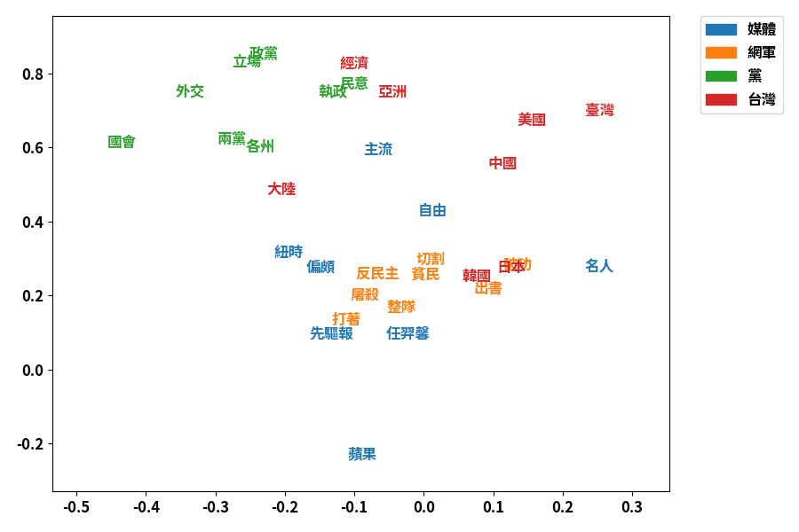

# Result



```
媒體
[('主流', 0.67372482) ('偏頗', 0.63249569) ('紐時', 0.62211737)
 ('自由', 0.60821955) ('任羿馨', 0.60231029) ('名人', 0.59313954)
 ('蘋果', 0.59293508) ('先驅報', 0.59015056)]
網軍
[('整隊', 0.8883443 ) ('切割', 0.88331638) ('屠殺', 0.87351943)
 ('打著', 0.87059687) ('出書', 0.86813753) ('破功', 0.86763727)
 ('反民主', 0.86652659) ('貧民', 0.86504442)]
黨
[('兩黨', 0.88302987) ('國會', 0.87966222) ('立場', 0.87084928)
 ('民意', 0.86715953) ('政黨', 0.86440996) ('執政', 0.85980577)
 ('各州', 0.8494322 ) ('外交', 0.84620168)]
台灣
[('中國', 0.84139476) ('日本', 0.79866064) ('臺灣', 0.79035884)
 ('亞洲', 0.76119477) ('美國', 0.74024595) ('韓國', 0.7258324 )
 ('經濟', 0.70348684) ('大陸', 0.70298475)]
```